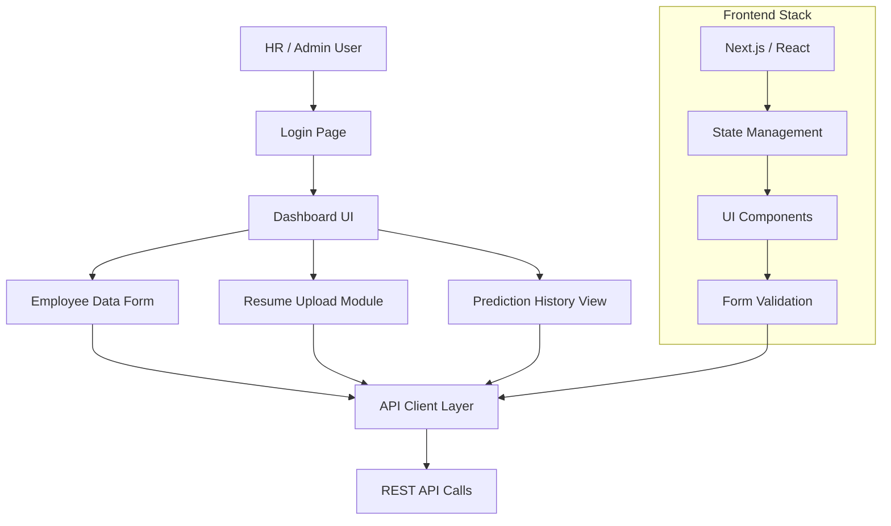

```mermaid
flowchart TD

A[HR / Admin User] --> B[Login Page]
B --> C[Dashboard UI]

C --> D[Employee Data Form]
C --> E[Resume Upload Module]
C --> F[Prediction History View]

D --> G[API Client Layer]
E --> G
F --> G

G --> H[REST API Calls]

subgraph Frontend Stack
    I[Next.js / React]
    J[State Management]
    K[UI Components]
    L[Form Validation]
end

I --> J --> K --> L --> G
```
