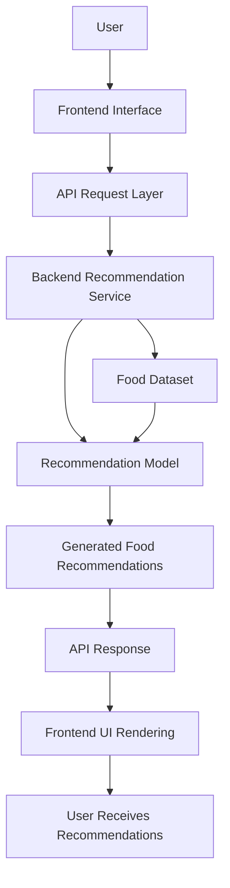

# FoodTech Recommendation Frontend  
AI-Powered Food Discovery & Recommendation Interface

## Overview

This repository contains the frontend interface for the AI-based Food Recommendation platform. The application provides an interactive environment where users can explore food items, submit preference queries, and receive personalized recommendations generated by the backend recommendation engine.

The frontend functions as the user interaction layer of the system, enabling seamless communication with the AI recommendation service. It focuses on usability, responsiveness, and clear visualization of recommended food items.

The project is designed using a modular UI structure so that it can easily integrate with machine learning models, API-based recommendation engines, and food dataset pipelines.

---

## Core Idea

The FoodTech Recommendation Frontend allows users to interact with an intelligent food recommendation system through a simple web interface.

The system combines:

User interaction and food search  
AI-powered recommendation responses  
Dynamic UI components for displaying suggestions  
API communication with backend services  

The design prioritizes clear user interaction, responsive UI behavior, and flexibility for integrating advanced recommendation capabilities in the future.

---

## System Capabilities

### User Interaction Layer

Interactive interface for requesting food recommendations.

Users can:

Search for food items  
Provide preference-based queries  
Explore recommended dishes  

---

### Recommendation Visualization

Display of AI-generated food recommendations.

Features include:

Structured presentation of food results  
Visual grouping of recommended items  
Support for ranking or scoring outputs in the future  

---

### API Integration

Communication between the frontend and backend services.

Capabilities include:

REST API communication with recommendation engine  
Asynchronous data retrieval  
Request handling and response processing  

---

### Modular UI Components

The frontend follows a component-based architecture.

Advantages include:

Reusable UI elements  
Separation of layout and logic  
Easy feature expansion and maintenance  

---

## High-Level Architecture

The system acts as the interaction layer between users and the AI recommendation backend.

Core Layers:

Interface Layer – User interaction through the web UI  
Communication Layer – API requests to backend recommendation services  
Recommendation Layer – Backend AI model generates food suggestions  
Presentation Layer – Results displayed through structured UI components  

This architecture ensures clean separation between UI, business logic, and machine learning infrastructure.

---

## Design Principles

User-centric interface design  
Modular component-based architecture  
Clear separation of frontend and backend responsibilities  
Scalable API communication layer  
Lightweight and developer-friendly setup  

---

## Workflow Summary

User opens the food recommendation interface  
User provides food preferences or search input  
Frontend sends request to the recommendation API  
Backend AI model processes the request  
Recommended food items are returned to the frontend  
Results are rendered and displayed in the UI  

---

## Technology Stack

Language: JavaScript  
Framework: React.js  
UI Technologies: HTML5, CSS3  
API Communication: Axios / Fetch  
Architecture Style: Component-based frontend architecture  

---

## Intended Use Cases

AI-powered food discovery platforms  
Smart restaurant recommendation systems  
Personalized diet planning interfaces  
Food delivery recommendation platforms  
Educational demonstrations of recommendation systems  

---

## License

This project is licensed under the MIT License.
