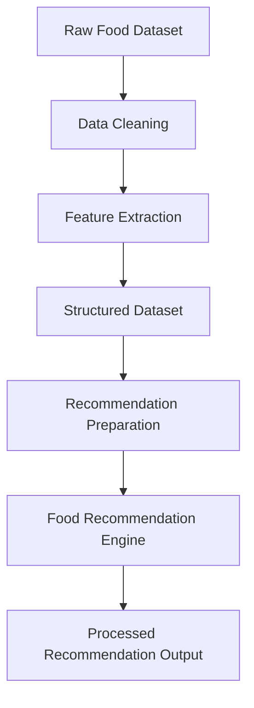

# FoodTech Recommendation System – Phase 1  
Data Processing & Initial Recommendation Pipeline

## Overview

Phase 1 of the FoodTech Recommendation System focuses on the foundational components required to build an AI-driven food recommendation engine. This phase establishes the data pipeline, preprocessing workflow, and initial recommendation logic that power the system.

The objective of this phase is to transform raw food datasets into structured and usable formats that can be used by the recommendation engine. It includes dataset preparation, feature extraction, and early-stage recommendation modeling.

This phase acts as the **core data foundation** for the later phases involving API services, frontend integration, and AI-driven recommendation interfaces.

---

## Core Idea

Phase 1 builds the fundamental pipeline required for generating food recommendations from structured datasets.

### The system combines

- Food dataset ingestion and preprocessing  
- Feature extraction from food attributes  
- Initial recommendation logic  
- Structured data transformation for AI models  

### Design Priorities

- Clean and structured data processing workflow  
- Scalable data pipeline for large food datasets  
- Modular preprocessing architecture  
- Compatibility with future AI recommendation models  

---

## System Capabilities

### Dataset Processing

- Loading and parsing food datasets  
- Cleaning and normalizing food data  
- Handling missing or inconsistent records  

Users can process:

- Raw food datasets  
- Structured recipe data  
- Food attribute metadata  

---

### Feature Engineering

Transformation of raw food data into meaningful features.

Features include:

- Ingredient-based feature extraction  
- Food category mapping  
- Nutritional attribute structuring  

---

### Recommendation Preparation

Preparation of processed data for recommendation algorithms.

Capabilities include:

- Data transformation for recommendation models  
- Creation of structured food vectors  
- Preparation for similarity-based or AI-driven recommendations  

---

### Data Pipeline Structure

The phase follows a modular data pipeline design.

Advantages include:

- Reusable preprocessing components  
- Clear separation between raw data and processed features  
- Easy integration with future ML pipelines  

---

## High-Level Architecture

### Core Layers

- **Dataset Layer** – Raw food datasets and metadata  
- **Processing Layer** – Data cleaning and preprocessing modules  
- **Feature Layer** – Extraction of meaningful food attributes  
- **Recommendation Layer** – Data prepared for recommendation algorithms  

This layered structure ensures clean separation between data ingestion, processing, and recommendation preparation.

---

## Design Principles

- Data-first architecture  
- Modular preprocessing pipeline  
- Clean transformation of raw food datasets  
- Scalability for large datasets  
- Compatibility with future AI recommendation models  

---

## Workflow Summary

- Raw food dataset is loaded into the system  
- Data cleaning and preprocessing are applied  
- Features are extracted from food attributes  
- Structured dataset is generated  
- Data is prepared for recommendation algorithms  
- Processed output is used by the recommendation engine  

---

## Technology Stack

| Component | Technology |
|----------|-------------|
| Language | Python |
| Data Processing | Pandas |
| Dataset Handling | CSV / Structured datasets |
| Data Pipeline | Python data processing scripts |
| Architecture Style | Modular data processing pipeline |

---

## Intended Use Cases

- Food recommendation dataset preparation  
- Feature engineering for food recommendation models  
- Dataset preprocessing for AI-based food systems  
- Research and experimentation with food datasets  
- Foundation for recommendation system development  

---

## License

This project is licensed under the MIT License.
