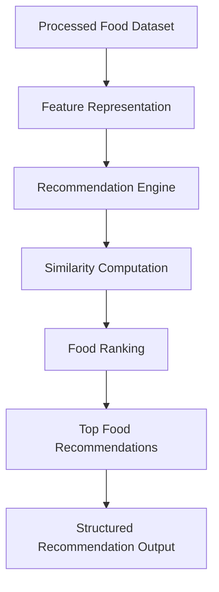

# FoodTech Recommendation System – Phase 2  
AI Recommendation Engine & Model Layer

## Overview

Phase 2 of the FoodTech Recommendation System focuses on the development of the core recommendation engine responsible for generating intelligent food suggestions. This phase introduces the algorithmic and model-driven components that analyze food datasets and produce personalized recommendations.

The recommendation engine processes structured food data prepared in Phase 1 and applies similarity-based or model-based approaches to determine relevant food suggestions. This layer acts as the intelligence component of the system and forms the foundation for API services and frontend integration.

The design emphasizes modular recommendation logic, scalability for different datasets, and flexibility to integrate advanced machine learning models in future iterations.

---

## Core Idea

Phase 2 implements the core logic required to generate food recommendations using structured food datasets.

### The system combines

- Processed food datasets from Phase 1  
- Recommendation algorithms and similarity models  
- Feature-based food matching techniques  
- Structured recommendation outputs for system integration  

### Design Priorities

- Modular recommendation engine architecture  
- Efficient similarity computation and ranking  
- Compatibility with future AI and deep learning models  
- Clear separation between data processing and recommendation logic  

---

## System Capabilities

### Recommendation Engine

Core module responsible for generating food recommendations.

Capabilities include:

- Food similarity analysis  
- Ranking of recommended items  
- Feature-based recommendation logic  

---

### Food Matching Logic

Algorithms that identify similar food items based on attributes.

Features include:

- Ingredient-based similarity comparison  
- Category-based food matching  
- Ranking of candidate food items  

---

### Recommendation Output Generation

Structured output generation for integration with APIs or frontend services.

Capabilities include:

- Ranked food recommendation lists  
- Structured recommendation responses  
- Integration-ready data formats  

---

### Model Integration Layer

The system is designed to allow integration of machine learning models.

Advantages include:

- Easy integration of collaborative filtering models  
- Compatibility with content-based recommendation techniques  
- Support for future deep learning recommendation systems  

---

## High-Level Architecture

### Core Layers

- **Dataset Layer** – Processed food datasets generated in Phase 1  
- **Feature Layer** – Representation of food attributes and characteristics  
- **Recommendation Layer** – Algorithms that compute similarity and ranking  
- **Output Layer** – Structured recommendation results for system consumption  

This layered structure ensures separation between dataset preparation, recommendation logic, and output generation.

---

## Design Principles

- Modular recommendation engine architecture  
- Separation of data, model, and output layers  
- Scalable recommendation computation  
- Compatibility with multiple recommendation algorithms  
- Clean integration with APIs and frontend applications  

---

## Workflow Summary

- Processed dataset from Phase 1 is loaded  
- Food attributes are converted into feature representations  
- Recommendation algorithms compute similarity between food items  
- Candidate foods are ranked based on relevance  
- Top food recommendations are generated  
- Structured recommendation outputs are returned for system integration  

---

## Technology Stack

| Component | Technology |
|----------|-------------|
| Language | Python |
| Data Processing | Pandas, NumPy |
| Recommendation Methods | Similarity-based / Content-based filtering |
| Model Framework | Scikit-learn |
| Architecture Style | Modular recommendation engine |

---

## Intended Use Cases

- AI-based food recommendation engines  
- Personalized food suggestion systems  
- Smart restaurant recommendation platforms  
- Diet planning and nutrition advisory systems  
- Research and experimentation with recommender systems  

---

## License

This project is licensed under the MIT License.
