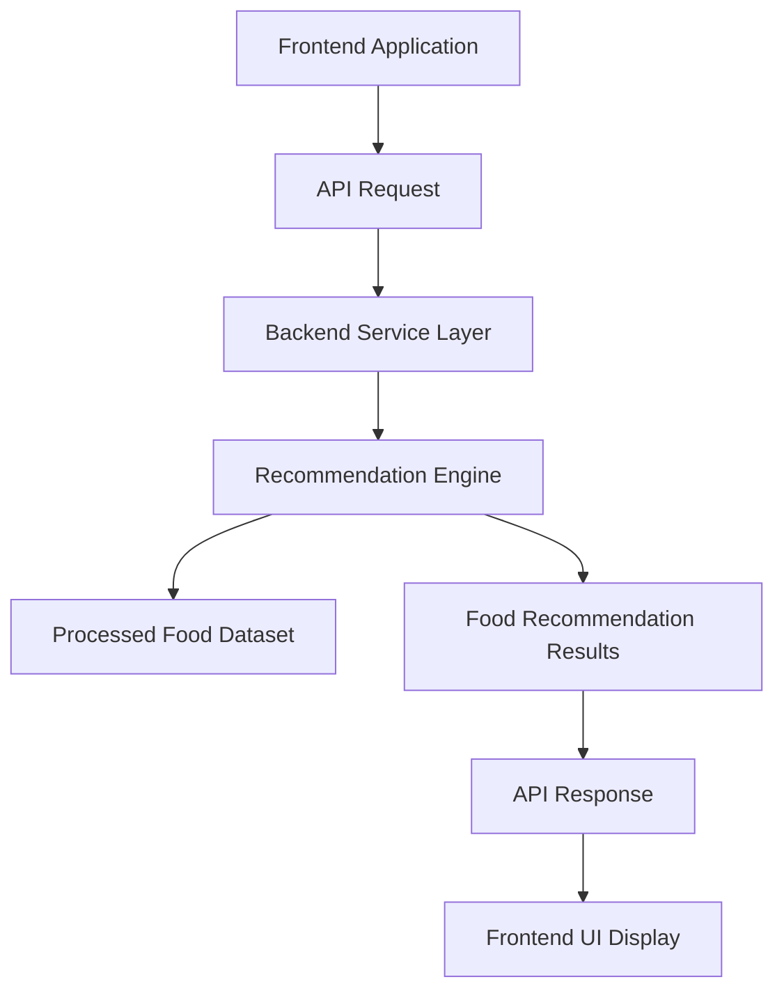

# FoodTech Recommendation System – Phase 3  
Backend API & Service Layer

## Overview

Phase 3 of the FoodTech Recommendation System focuses on building the backend service layer that connects the recommendation engine with external applications such as the frontend interface. This phase introduces API endpoints, request handling, and system services that allow users to query the recommendation engine and retrieve results dynamically.

The backend acts as the communication bridge between the frontend interface and the AI recommendation logic. It processes incoming requests, invokes the recommendation engine, and returns structured responses to the client application.

This phase ensures that the recommendation system can operate as a scalable service capable of handling multiple requests and integrating with web or mobile interfaces.

Modern food recommendation systems typically follow a layered architecture where the frontend interacts with backend APIs that process requests and communicate with data and model layers. :contentReference[oaicite:0]{index=0}

---

## Core Idea

Phase 3 exposes the recommendation engine as an API-based service that can be consumed by frontend applications or external systems.

### The system combines

- Backend API endpoints for recommendation queries  
- Integration with the recommendation engine from Phase 2  
- Request processing and response formatting  
- Communication with frontend applications  

### Design Priorities

- Scalable backend service architecture  
- Clean API design for recommendation queries  
- Efficient request handling and response generation  
- Separation between API logic and recommendation algorithms  

---

## System Capabilities

### API Service Layer

Backend service responsible for handling recommendation requests.

Capabilities include:

- Processing client requests  
- Invoking recommendation engine functions  
- Returning structured response data  

---

### Recommendation Query Handling

Processing user inputs received through API calls.

Features include:

- Parsing request parameters  
- Validating query inputs  
- Triggering recommendation generation  

---

### Response Generation

Formatting results from the recommendation engine into structured API responses.

Capabilities include:

- JSON-based response structures  
- Ranked recommendation results  
- Integration-ready API responses  

---

### Service Integration

The backend is designed to integrate with other system components.

Advantages include:

- Easy integration with frontend applications  
- Compatibility with external services or mobile clients  
- Scalable service architecture for future extensions  

---

## High-Level Architecture

### Core Layers

- **Client Layer** – Frontend applications sending recommendation requests  
- **API Layer** – Backend endpoints handling requests and responses  
- **Service Layer** – Business logic invoking the recommendation engine  
- **Recommendation Layer** – AI recommendation algorithms generating results  

This layered structure separates client interaction, service logic, and AI model computation, improving maintainability and scalability. :contentReference[oaicite:1]{index=1}

---

## Design Principles

- Modular backend architecture  
- Clear API contract between frontend and backend  
- Separation of service logic and recommendation algorithms  
- Scalable service design for multiple users  
- Clean integration with frontend applications  

---

## Workflow Summary

- User submits a request from the frontend interface  
- Frontend sends an API request to the backend service  
- Backend processes the request parameters  
- Recommendation engine generates food suggestions  
- Backend formats the results into API responses  
- Frontend receives and displays the recommendations  

---

## Technology Stack

| Component | Technology |
|----------|-------------|
| Language | Python |
| API Framework | FastAPI / Flask |
| Data Handling | Pandas |
| Communication Format | JSON |
| Architecture Style | API-based service architecture |

---

## Intended Use Cases

- Backend service for food recommendation platforms  
- API layer for AI-powered food applications  
- Integration with web and mobile interfaces  
- Scalable recommendation service deployment  
- Backend experimentation for AI recommendation systems  

---

## License

This project is licensed under the MIT License.
