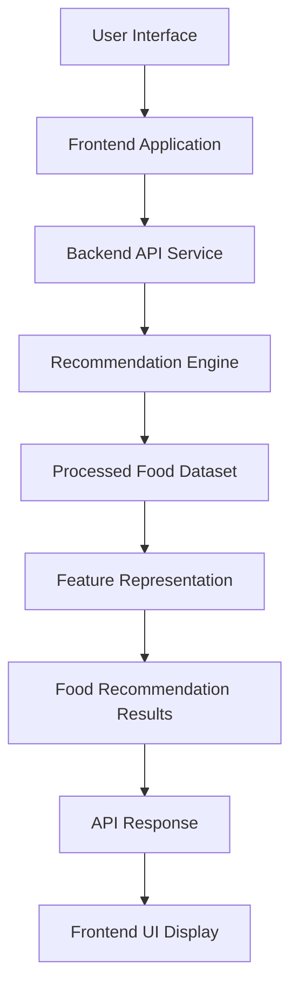

# FoodTech Recommendation System – Phase 4  
AI Integration & End-to-End System Orchestration

## Overview

Phase 4 of the FoodTech Recommendation System focuses on integrating the previously developed components into a unified AI-powered food recommendation pipeline. This phase connects the data pipeline, recommendation engine, backend service layer, and frontend interface into a complete system capable of generating real-time food recommendations.

The goal of this phase is to ensure seamless interaction between different system modules while maintaining scalability and modularity. The system orchestrates data flow between the recommendation engine, backend APIs, and user-facing interfaces.

Modern food recommendation systems typically rely on multiple integrated components such as data pipelines, AI models, and service layers working together to generate personalized recommendations for users. :contentReference[oaicite:0]{index=0}

---

## Core Idea

Phase 4 orchestrates the full system pipeline required to deliver AI-driven food recommendations to end users.

### The system combines

- Data pipeline from Phase 1  
- Recommendation engine from Phase 2  
- Backend API services from Phase 3  
- Frontend user interface  

### Design Priorities

- End-to-end system integration  
- Efficient communication between system modules  
- Modular architecture for future feature expansion  
- Scalable recommendation infrastructure  

---

## System Capabilities

### System Integration Layer

Coordinates interaction between different system modules.

Capabilities include:

- Connecting data pipeline with recommendation engine  
- Managing backend API interactions  
- Supporting real-time recommendation queries  

---

### End-to-End Recommendation Flow

Complete pipeline from user input to recommendation output.

Features include:

- User request processing  
- Recommendation model invocation  
- Structured recommendation delivery  

---

### Service Orchestration

Handles communication between system components.

Capabilities include:

- Managing data flow between modules  
- Coordinating API requests and responses  
- Maintaining system reliability and performance  

---

### Scalability Support

The architecture allows the system to expand easily.

Advantages include:

- Support for additional recommendation models  
- Integration with external food datasets  
- Deployment-ready architecture for production environments  

---

## High-Level Architecture

### Core Layers

- **Interface Layer** – User-facing frontend interface  
- **API Layer** – Backend service responsible for handling requests  
- **Recommendation Layer** – AI recommendation engine generating suggestions  
- **Data Layer** – Processed datasets and food attributes used by the model  

This layered architecture enables modular system expansion while maintaining clear separation between user interaction, service logic, and recommendation intelligence.

---

## Design Principles

- End-to-end modular system architecture  
- Clear separation between data, model, and interface layers  
- Scalable recommendation infrastructure  
- Flexible integration with additional AI models  
- Clean orchestration between system components  

---

## Workflow Summary

- User interacts with the frontend interface  
- Frontend sends request to backend API  
- Backend triggers the recommendation engine  
- Recommendation engine analyzes processed food dataset  
- AI model generates ranked food recommendations  
- Backend returns structured results to frontend  
- Recommended food items are displayed to the user  

---

## Technology Stack

| Component | Technology |
|----------|-------------|
| Language | Python |
| Backend Framework | FastAPI / Flask |
| Recommendation Engine | Scikit-learn / ML models |
| Data Processing | Pandas, NumPy |
| System Architecture | Modular AI system pipeline |

---

## Intended Use Cases

- AI-powered food recommendation platforms  
- Personalized meal discovery applications  
- Smart restaurant recommendation systems  
- Diet planning and nutrition advisory systems  
- AI experimentation for recommender systems  

---

## License

This project is licensed under the MIT License.
