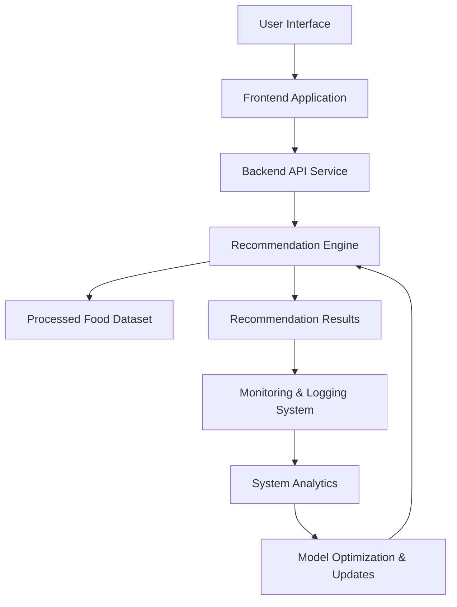

# FoodTech Recommendation System – Phase 5  
Deployment, Monitoring & System Optimization

## Overview

Phase 5 of the FoodTech Recommendation System focuses on preparing the system for deployment, monitoring system performance, and optimizing the recommendation pipeline. This phase ensures that the complete AI-powered food recommendation platform can operate reliably in real-world environments.

The system integrates all previous phases—including data pipelines, recommendation models, backend APIs, and frontend interfaces—into a deployable architecture. The goal is to enable scalable operation, maintain performance, and support continuous improvements through monitoring and feedback mechanisms.

Modern AI recommendation platforms typically incorporate deployment pipelines, monitoring systems, and feedback loops to maintain performance and continuously improve recommendation quality. :contentReference[oaicite:0]{index=0}

---

## Core Idea

Phase 5 operationalizes the entire FoodTech recommendation system and prepares it for production deployment.

### The system combines

- Full system deployment of previous phases  
- Monitoring of recommendation performance  
- Logging and analytics for system behavior  
- Continuous optimization of recommendation outputs  

### Design Priorities

- Production-ready system deployment  
- Reliable API and service availability  
- Performance monitoring and logging  
- Continuous improvement of recommendation accuracy  

---

## System Capabilities

### Deployment Infrastructure

Responsible for deploying and running the system in a production environment.

Capabilities include:

- Deployment of backend API services  
- Hosting of recommendation models  
- Integration with frontend applications  

---

### Monitoring & Logging

Tracks system performance and operational health.

Features include:

- API request monitoring  
- Logging of recommendation queries  
- Tracking system errors and response times  

---

### Performance Optimization

Improves efficiency and accuracy of recommendations.

Capabilities include:

- Optimization of recommendation algorithms  
- Efficient data retrieval and processing  
- System performance tuning  

---

### Feedback & Improvement Loop

Collects system feedback to improve recommendations over time.

Advantages include:

- User feedback collection  
- Logging of recommendation outcomes  
- Continuous improvement of recommendation models  

---

## High-Level Architecture

### Core Layers

- **Interface Layer** – User-facing frontend applications  
- **API Layer** – Backend services handling system requests  
- **Recommendation Layer** – AI models generating food recommendations  
- **Monitoring Layer** – System logs and analytics tracking performance  
- **Optimization Layer** – Continuous improvement of recommendation models  

This layered architecture supports scalable deployment while maintaining system reliability and performance.

---

## Design Principles

- Production-ready AI system architecture  
- Continuous monitoring and logging  
- Modular deployment infrastructure  
- Scalable backend service architecture  
- Continuous improvement through feedback loops  

---

## Workflow Summary

- User interacts with the food recommendation interface  
- Frontend sends request to backend API  
- Backend invokes the recommendation engine  
- AI model generates food recommendations  
- Results are returned to the frontend interface  
- System logs and monitoring capture performance data  
- Optimization processes update and improve the recommendation system  

---

## Technology Stack

| Component | Technology |
|----------|-------------|
| Language | Python |
| Backend Framework | FastAPI / Flask |
| Monitoring | Logging & analytics tools |
| Deployment | Docker / Cloud services |
| Architecture Style | Production-ready AI system pipeline |

---

## Intended Use Cases

- Deployment of AI-powered food recommendation platforms  
- Production-ready recommender system infrastructure  
- Monitoring and optimization of recommendation engines  
- Scalable food discovery platforms  
- Research and experimentation in recommendation system deployment  

---

## License

This project is licensed under the MIT License.
