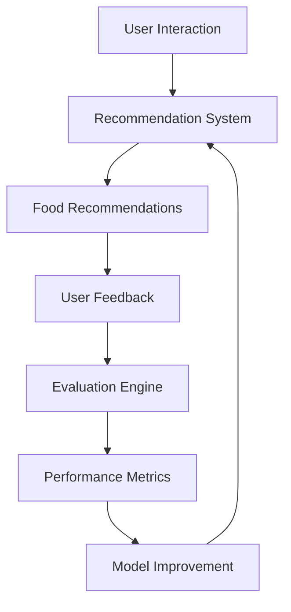

# FoodTech Recommendation System – Phase 6  
Evaluation, Feedback & Continuous Learning

## Overview

Phase 6 focuses on evaluating the performance of the FoodTech Recommendation System and improving the model using feedback and performance metrics. This phase ensures that the recommendation engine delivers accurate, relevant, and personalized food suggestions.

The evaluation layer analyzes how well the recommendation system performs using both offline and online metrics. Offline evaluation uses historical datasets to measure prediction accuracy, while online evaluation relies on real user interactions and feedback. This process helps refine the recommendation models and improve system performance over time.

In modern recommender systems, evaluation and feedback loops are critical because user behavior and preferences constantly evolve. Continuous evaluation allows the system to adapt and maintain high-quality recommendations. :contentReference[oaicite:0]{index=0}

---

## Core Idea

Phase 6 introduces evaluation mechanisms that measure the effectiveness of food recommendations and incorporate feedback to improve future recommendations.

### The system combines

- Offline evaluation of recommendation models  
- Online evaluation through user interactions  
- Feedback collection from users  
- Continuous improvement of recommendation algorithms  

### Design Priorities

- Reliable evaluation metrics for recommendation quality  
- Continuous feedback collection from users  
- Iterative improvement of recommendation models  
- Monitoring of recommendation performance  

---

## System Capabilities

### Recommendation Evaluation

Evaluation of recommendation accuracy and performance.

Capabilities include:

- Accuracy measurement of recommendations  
- Ranking performance evaluation  
- Comparison of different recommendation algorithms  

---

### Offline Evaluation

Evaluation using historical dataset without real-time user interaction.

Common metrics include:

- Root Mean Squared Error (RMSE)  
- Mean Absolute Error (MAE)  
- Precision@K  
- Recall@K  
- NDCG (Normalized Discounted Cumulative Gain)

These metrics measure how well the system predicts user preferences and ranks relevant items in recommendation lists. :contentReference[oaicite:1]{index=1}

---

### Online Evaluation

Evaluation based on real user interactions with the system.

Features include:

- Click-through rate analysis  
- User interaction tracking  
- A/B testing of recommendation models  

Online evaluation helps determine how recommendations perform in real-world usage scenarios. :contentReference[oaicite:2]{index=2}

---

### Feedback Collection

The system gathers feedback to refine recommendations.

Types of feedback include:

- Explicit feedback (ratings or likes)  
- Implicit feedback (clicks, searches, interactions)

Both feedback types help the system better understand user preferences and improve recommendation accuracy. :contentReference[oaicite:3]{index=3}

---

## High-Level Architecture

### Core Layers

- **Recommendation Layer** – Generates food recommendations  
- **Evaluation Layer** – Measures system performance  
- **Feedback Layer** – Collects user interactions and responses  
- **Optimization Layer** – Improves models using evaluation results  

This cyclic architecture allows the system to continuously learn and improve its recommendations.

---

## Design Principles

- Continuous evaluation and improvement  
- Data-driven model optimization  
- Integration of user feedback loops  
- Scalable evaluation infrastructure  
- Adaptive recommendation models  

---

## Workflow Summary

- User interacts with the food recommendation interface  
- Recommendation engine generates food suggestions  
- User behavior and feedback are captured  
- Evaluation engine analyzes recommendation performance  
- Metrics are calculated to measure system effectiveness  
- Model improvements are applied to enhance recommendations  

---

## Technology Stack

| Component | Technology |
|----------|-------------|
| Language | Python |
| Data Processing | Pandas, NumPy |
| Evaluation Metrics | Scikit-learn metrics |
| Experimentation | A/B Testing |
| Architecture Style | Continuous learning pipeline |

---

## Intended Use Cases

- Evaluation of AI-powered recommendation systems  
- Continuous improvement of food recommendation models  
- Performance monitoring of recommender systems  
- Research and experimentation with recommendation metrics  
- Data-driven optimization of food discovery platforms  

---

## License

This project is licensed under the MIT License.
